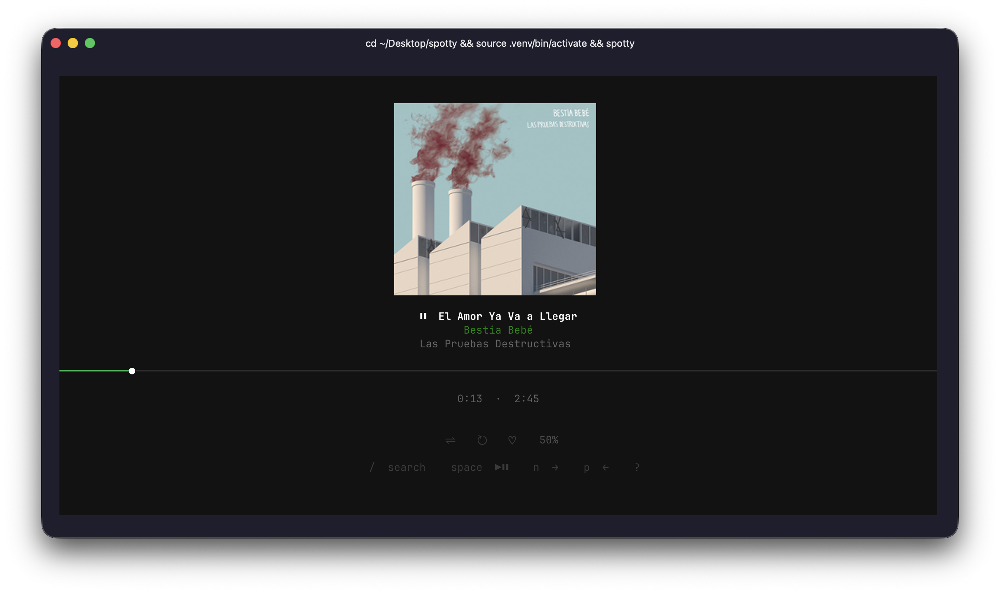

# spotty

A Spotify TUI built in Python using Textual and the Spotify Web API.



## Features

- **Now playing** — full-screen view with album art (Sixel/Kitty/half-block depending on terminal), track info, and a real-time progress bar with `━━━●━━━` cursor
- **Search** — `/` opens a search overlay; toggle between tracks and albums with `Tab`
- **Album browsing** — selecting an album shows its tracklist so you can choose where to start
- **Playlists** — `o` opens your playlists; select one to start playing it
- **Queue / Recommendations** — `u` shows upcoming tracks; falls back to similar artists if the queue is empty
- **Lyrics** — `l` fetches and displays lyrics for the current track (scrollable with `j`/`k`)
- **Recently played** — `r` shows your listening history
- **Smart next** — `n` skips to the next track; if there is no queue context, automatically plays something similar
- **Playback controls** — `space` play/pause, `n` next, `p` previous, `+`/`-` volume
- **Auto device activation** — if no device is active, spotty finds one and transfers playback automatically
- **spotifyd integration** — optional local audio daemon so spotty works completely standalone (no phone or desktop app needed)

## Requirements

- Python 3.11+
- Spotify Premium account (required for playback control via the Web API)

## Installation

```bash
git clone https://github.com/amarazzi/spotty
cd spotty
python -m venv .venv
source .venv/bin/activate
pip install -e .
```

No `.env` or API keys needed — spotty uses its own registered Spotify app via PKCE.

## Running

```bash
source .venv/bin/activate
spotty
```

First run opens a browser for Spotify OAuth. Log in, copy the redirect URL from the address bar, paste it in the terminal. Token is cached at `~/.spotify_cache` — you only authenticate once.

## Local audio (spotifyd)

To use spotty without any Spotify app running:

```bash
brew install spotifyd
```

On next launch, spotty detects spotifyd, authenticates once, and starts it automatically. From then on, spotty is fully self-contained — no phone or desktop Spotify app needed.

## Keybindings

| Key | Action |
|---|---|
| `space` | Play / Pause |
| `n` | Next track (auto-plays similar if no queue) |
| `p` | Previous track |
| `+` / `=` | Volume +5% |
| `-` | Volume −5% |
| `/` | Search (tracks & albums, `Tab` to toggle) |
| `l` | Lyrics |
| `o` | Playlists |
| `r` | Recently played |
| `u` | Queue / Recommendations |
| `q` | Quit |

Inside overlays: `j`/`k` to navigate, `Enter` to select, `Esc` to close.

## Stack

- [Textual](https://github.com/Textualize/textual) — TUI framework
- [spotipy](https://github.com/spotipy-dev/spotipy) — Spotify Web API + OAuth
- [textual-image](https://github.com/lnqs/textual-image) — Sixel/Kitty album art
- [rich-pixels](https://github.com/darrenburns/rich-pixels) — half-block fallback
- [Pillow](https://python-pillow.org/) — image processing
- [httpx](https://www.python-httpx.org/) — async HTTP for cover art
- [syncedlyrics](https://github.com/moehmeni/syncedlyrics) — multi-source lyrics fetcher
- [spotifyd](https://github.com/Spotifyd/spotifyd) — optional local Spotify Connect daemon
